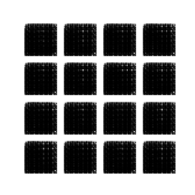
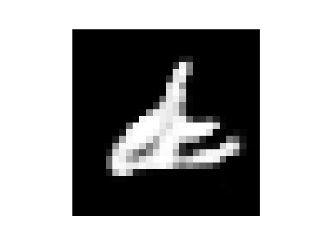
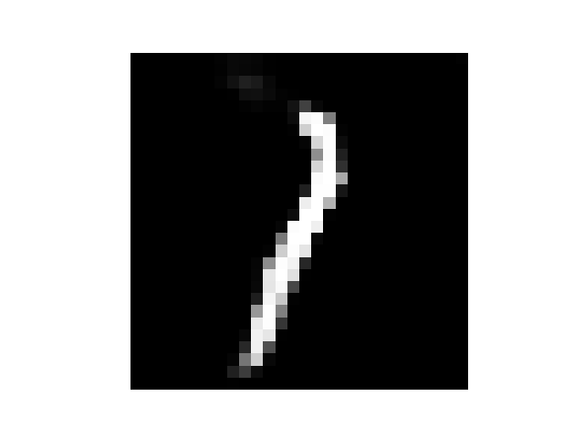
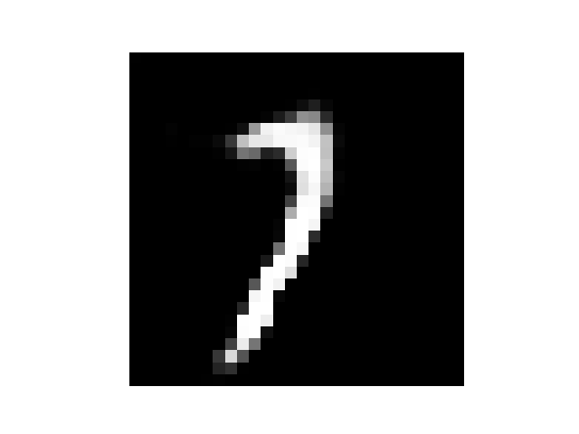
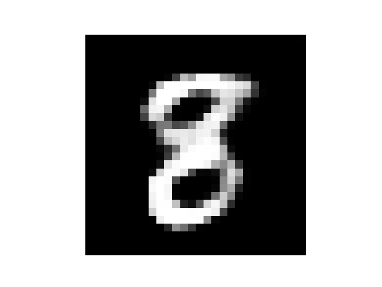
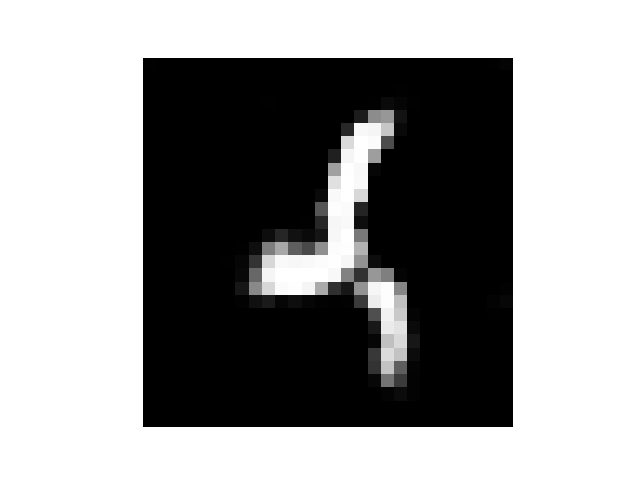

# Deep-Convolutional-Generative-Adversarial-Network
This repository demonstrates how to generate images of handwritten digits using a Deep Convolutional Generative Adversarial Network (DCGAN).

An implementation of 2015 DCGAN [Unsupervised Representation Learning with Deep Convolutional Generative Adversarial Networks](https://arxiv.org/abs/1511.06434)

Images generated during model training


## File description

|file name|content|
|-|-|
|dataset_utils.py||
|train_dcgan_model.py||
|inference_by_dcgan_model.py||
|training_checkpoints|Save model weight|
|train_epoch_produce_images|The picture generated during the training of the model is generated one per training period. Used to check the effect of the model to generate a picture.|
|inference_produce_images|Save images generated using trained models|


## Require

+ python 3+
+ tensorflow version 2

## Code usage

> Training_checkpoints already has trained model weights that can be used directly to execute 3. Model Inference.

### 1. Prepare Data

```python
python dataset_utils.py
```

### 2. Train Model

```python
python train_dcgan_model.py
```

### 3. Model Inference

```python
python inference_by_dcgan_model.py
```

## Image generated image effects

>  EPOCHS = 50








